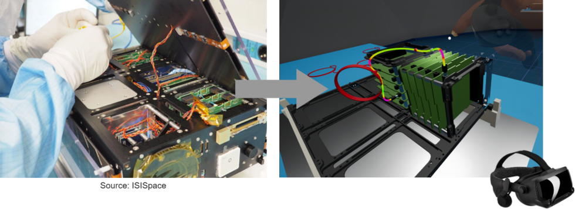

About
=====

.. autosummary::
   :toctree: generated

Training for assembly procedures mostly makes use of physical models of the actual hardware. Because of this approach, cost of training is generally high and the level of flexibility to accommodate changes in configurations is low. Furthermore, as physical models are manufactured at discrete moments in the development program, the availability of these models and therefore the actual moment of training is predefined and fixed. Moreover, in a commercial space environment where recurrence in hardware production and integration is to be expected, it is essential to retain knowledge of applied processes and procedures in these fields.

When using an immersive tool to capture the knowledge on how to apply these procedures, that data can at a later stage unambiguously be transferred to new project participants or new employees. This has the added benefit of lowering the need for a certain skill level in the labour force which inevitably leads to cost reduction.

ICARUS
------

Because of the above, ATG Europe, NLR and ISISapce are developing ICARUS, a **Virtual Reality tool aimed at training of mechanical assembly and integration processes**.

ICARUS offers the following key benefits to its users:

– Train mechanical assembly and integration processes in a virtual environment at any moment in time, either guided (instructions) or non-guided (trying-out what is possible). This will provide more flexibility in the timing of the training and much lower cost by not using actual physical flight hardware for training purposes.

– Improve knowledge retention of the recurring operations through a virtual representation of the customers procedures. Thereby enabling an easier transfer of knowledge to new employees, increasing their productivity, and lowering the initial skill level required.

Thus, ICARUS will enable users to improve the efficiently, increase the flexibility and decrease the risk of their assembly and integration processes considerably.

Are you interested in the benefits which ICARUS could offer your company? Get in touch:

https://fabform.io/a/create-a-contact-form-with-sphinx/